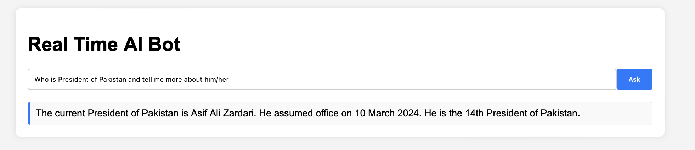

# Real-time AI Bot

This is a Flask-based AI Bot that leverages HuggingFace models and various tools for answering questions. The bot can retrieve information from Wikipedia, perform real-time data searches using DuckDuckGo, and execute Python code snippets.

## Features

- **Wikipedia Retriever**: Fetches information from Wikipedia for various topics.
- **Real-time Data Retrieval**: Uses DuckDuckGo to perform real-time web searches.
- **Python Code Execution**: Allows execution of Python code snippets for dynamic responses.

## Setup

1. Create and activate a virtual environment:
    ```bash
    python -m venv venv
    source venv/bin/activate  # On Windows use `venv\Scripts\activate`
    ```

2. Install dependencies:
    ```bash
    pip install -r requirements.txt
    ```

3. Run the Flask application:
    ```bash
    python app.py
    ```

4. Open your web browser and go to `http://127.0.0.1:5000/`.

## Usage

Type your question into the input box and click "Ask" to get a response from the AI Bot. The bot can answer a variety of questions, such as retrieving the current president of Pakistan or other real-time data.

## Example

Here is an example of the bot in action:

   
<div align="center">
  
</div>


In this example, the bot is asked, "Who is the president of Pakistan?" and it retrieves the correct answer using the integrated tools.


